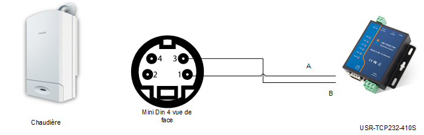
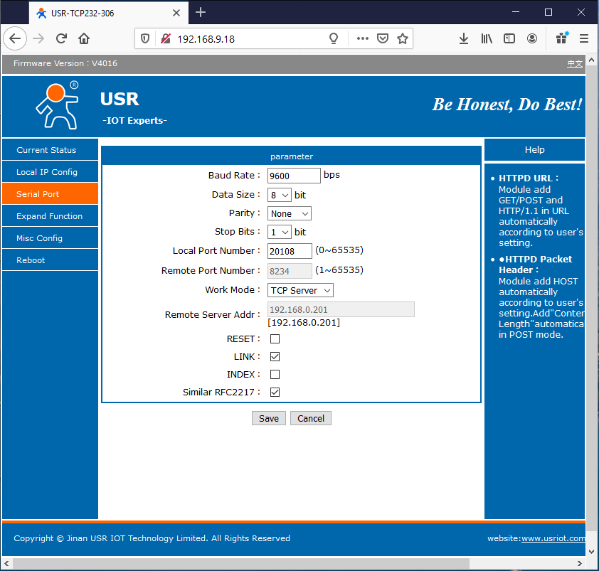

https://easydomoticz.com/forum/viewtopic.php?f=7&t=9520&p=78139#p78139# Diematic3-Domoticz-Plugin
<h2>Making of a plugin usable in domoticz for De Dietrich boiler with Diematic 3 regulator</h2>

The final goal is to be able to control boiler's general setting through Domoticz. But today only reading of parameters has been implemented.

Reminder : Diematic 3 regulator has a built-in control board like :

And a remote control board like :

I remind that if you use information and software available in this repository, It's mean that you feel enough qualified to manage what you are doing and its impacts.

<h2>General Design</h2>
<h3>ModBus Interface Description</h3>

Diematic 3 regulator is fitted with a ModBus interface which allows to read and modify measures and parameters.

There's very few documentation on the specification of the De Dietrich ModBus implementation. Used documents can be found on the web by using key words "diematic modbus register"

ModBus rely on data exchange on a serial bus. The Diematic 3 implementation is done with following details :

    RTU (binary) mode, on a RS485 bus
    9600 bauds, 8 bits, no parity, 1 stop bit
    boiler address is 0x0A (hexadecimal)

One specifity of the De Dietrich implementation is the dual-master :
    The boiler transmit ModBus command during 5s as a ModBus master and then remain silent during 5 next seconds  waiting for possible ModBus commandas slave (address: 0x0A).

My main requirements to design the solution were:
- to not spend too much time
- to not spend too much money
as at the beginning I was not sure to achieved something usable.

It's why I chose to use following elements :
- an interface USR-TCP-232-306 which is delivered in an enclosure and has bigger range for power supply voltage. USR-TCP-232-306 specifications can be found on USR-IOT website and bought averywhere. The interface RS485 port is connected on the ModBus port of the Boiler on on side and to the LAN on the other side. If you need it, you can use some WIFI version.
- a Raspberry running a Domoticz server.

<h2>Making of</h2>
<h3>Wiring</h3>

You can start with wiring the USR-TCP-232-306 to the boiler using a 2 wire cable and a mini DIN connector with four pins. The cable schematic is below:

<h3>Module settings</h3>
You can now go on with setting the USR-TCP-232-306  module with a standard web brother :

Remark : I let you read the doc to configure IP parameters of the USR-TCP-232-306. The TCP server address of the above page is not used

<h3>Domoticz plugin deployment</h3>

You just need to :
- copy the Diematic3-Domoticz directory itself into the plugin directory of your Domoticz server
- restart your Domoticz server
- add new hardware by selecting Diematic3 plugin, and setting ip address and ip port to connect to your USR module

You are now able to browse new Devices from your Domoticz interface :

<h3>Limitations</h3>

Parameters are read only.
Parameters are refreshed every minute

Main found limitations of the Diematic 3 interfaces are :
- Pump ECS (water heater) info not robust
- pump power stays at 100% when all pumps are off

<h3>Miscellaneous</h3>

For further info you can go to [Easymotociz Forum](https://easydomoticz.com/forum/viewtopic.php?f=7&t=9520&p=78139#p78139)
